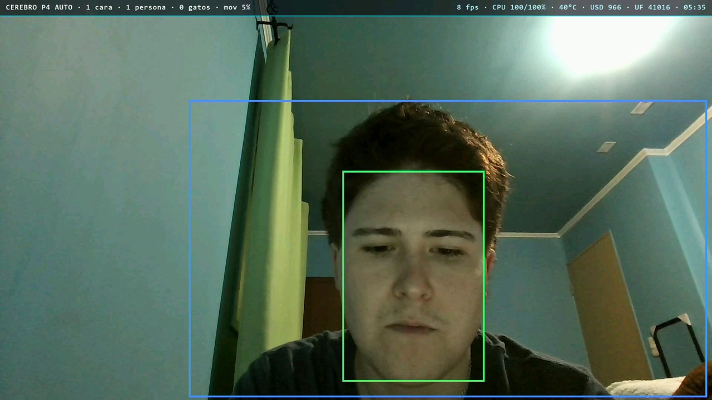
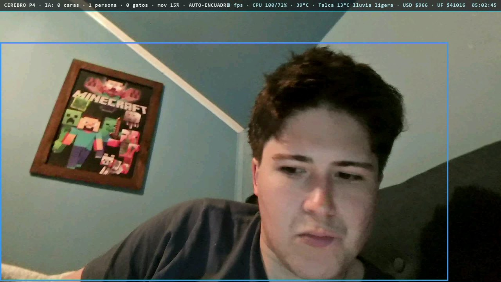

# Cerebro P4: investigación de IA en el ESP32-P4

**Español** · [English](#english)

**¿Cuánta inteligencia artificial cabe de verdad en un microcontrolador de US$15?** Cerebro P4 lo responde midiendo. Corre tres redes neuronales en el chip sobre video 1080p real, usa todos sus aceleradores a la vez y deja anotado dónde está el techo. El resultado útil es una webcam con IA que cualquier programa reconoce.

Un microcontrolador de ~US$15 que recibe la cámara del PC por USB, corre **tres redes neuronales**, sigue tu cara, dibuja una barra con datos de internet y devuelve una **webcam 1920×1080** que cualquier programa (Cámara de Windows, Meet, OBS) puede usar. Todo por **un solo cable USB-C**.

Placa: **Wireless-Tag WT9932P4-TINY** (módulo WT0132P4-A1, ESP32-P4 **revisión v1.0**, 16 MB flash, 32 MB PSRAM).

  

<p align="center"> </p>

*Cuadros reales que salen del P4. Izquierda: detección de cara (verde) y persona (azul) en modo Equilibrado. Derecha: la webcam UVC con auto-encuadre siguiendo la cara. Arriba, la barra con fps, CPU, temperatura y datos de internet que el P4 baja por HTTPS él mismo.*

## Qué hace
- **Webcam UVC** 1920×1080 en **MJPEG y H.264** (Windows la reconoce sin drivers).
- **Red USB (NCM)**: el P4 es `192.168.7.1`, con dashboard web, video en vivo y medición de cada acelerador. El PC recibe `192.168.7.2` **sin puerta de enlace**, así que su internet no cambia.
- **IA en el chip**: caras (ESPDet-Pico 224), personas (Pico 224) y gatos (ESPDet-Pico 224), con ESP-DL e instrucciones vectoriales PIE.
- **Auto-encuadre**: recorta y hace zoom siguiendo la cara (PPA).
- **H.264 con ROI** (más calidad en las caras) y **vectores de movimiento** como sensor de movimiento. Repetición descargable de los últimos ~25 s.
- **Internet propio por el cable**: el PC sólo abre un túnel TCP. El P4 hace el **HTTPS él mismo con su cifrado por hardware** (clima, dólar/UF, hora).
- **Núcleo LP** trabajando en paralelo, **LED RGB** de estado, sensor de temperatura.
- **Actualización del firmware por la red USB** (OTA con vuelta atrás automática).

## Arquitectura
```
PC: cámara ─ffmpeg→ JPEG ──TCP 5000──►┐
                                       │   ESP32-P4
   [dec]  decodificador JPEG HW ───────┘→ cuadro RGB565 1080p (2 búferes)
   [out]  2D-DMA → IA 320x180 (CPU, 3 redes) · PPA zoom/cajas/barra · codificador JPEG HW → UVC MJPEG
   [h264] PPA RGB→YUV420 → codificador H.264 HW (ROI + vectores) → repetición + UVC H.264
   [inet] túnel TCP del PC + mbedTLS con aceleradores → clima / dólar / hora
PC: ◄── webcam "Camara Cerebro P4" + dashboard http://192.168.7.1
```

## Mediciones (cámara HP del PC a 1920×1080, 30 fps)
| Perfil | fps de salida | CPU (núcleo 0 / 1) | Aceleradores |
|---|---|---|---|
| Fluido (sólo caras, sin grabar) | 16 | 64 / 77 % | JPEG enc 72 %, JPEG dec 43 % |
| Equilibrado | 8-9 | 100 / 100 % | PPA ~55 %, JPEG enc ~40 %, H.264 ~20 % |
| Máximo silicio | 6-7 | 100 / 100 % | PPA 55-80 %, JPEG enc ~45 %, H.264 ~25 % |

**El límite es la PSRAM (~300 MB/s compartidos), no los aceleradores.** Tiempos medidos en este chip v1.0:

| Operación | Sola | Con todo corriendo |
|---|---|---|
| JPEG decode 1080p | ~20 ms | ~30 ms |
| JPEG encode 1080p | 25 ms | 45-55 ms |
| H.264 encode 1080p | ~34 ms | — |
| PPA RGB565→YUV420 1080p | 69 ms | — |
| PPA escalado | ~33 ms por MP de entrada (bloques de 16x16 en v1.0) | — |

## Lecciones del ESP32-P4 v1.0 (útiles para cualquiera)
- Compilar con `CONFIG_ESP32P4_SELECTS_REV_LESS_V3=y` y a 360 MHz. Un binario v3 no arranca en v1.
- En v1.0, ni el decodificador JPEG ni la mezcla del PPA entregan YUV420. El H.264 sólo acepta YUV420, así que la conversión la hace el PPA SRM.
- El H.264 HW pide **~135 KB de RAM interna contigua**: bajar la caché L2 a 128 KB y crearlo antes que todo.
- La CPU copiando desde la PSRAM es muy lenta. Las copias grandes van por **2D-DMA** (`esp_async_color_convert`).
- TinyUSB 0.21: las macros `*_DISC` de video emiten mal los intervalos, y la lectura de descriptores *frame based* (H.264) usa el formato del MJPEG. Ver `main/usb.c`.
- Si el video a 30 fps deja sin turno al servidor web, subir la prioridad de `httpd`.

## Compilar y usar
1. ESP-IDF v6.1. Copiar `main/secrets.example.h` a `main/secrets.h` y poner una clave de OpenWeather.
2. `idf.py set-target esp32p4 && idf.py build`
3. Primera vez: cable en **FUSB (J3)** → `idf.py -p COMx flash`. Después, cable en **HUSB (J4)**.
4. En el PC: `python tools/puente.py --abrir` (requiere ffmpeg). Elegir la cámara **"Camara Cerebro P4"**.
5. Actualizaciones siguientes, por la red USB: `curl -X POST --data-binary @build/p4_webcam.bin http://192.168.7.1/ota`

## Archivos
| | |
|---|---|
| `main/pipeline.c` | tubería de video en paralelo (3 tareas) |
| `main/usb.c` | descriptores UVC + NCM y pegamento con lwIP |
| `main/ai.cpp` | los 3 detectores con un pozo de imágenes compartido |
| `main/inet.c` | HTTPS por túnel con mbedTLS |
| `main/web.c`, `main/dashboard.html` | dashboard, API y OTA |
| `main/ulp/main.c` | programa del núcleo LP |
| `tools/puente.py` | puente del PC: cámara, internet y medición |

## English

**How much AI really fits in a US$15 microcontroller?** Cerebro P4 answers by measuring. The ESP32-P4:

- receives the PC's camera over USB;
- runs **three neural networks** on the chip (faces, people and cats: ESPDet-Pico 224 with ESP-DL and the PIE vector instructions);
- follows your face with the PPA;
- returns a **1920×1080 UVC webcam** in MJPEG and H.264 that Windows, Meet or OBS use without drivers.

All of it goes over **one USB-C cable**, which also carries a USB network with a live dashboard and the P4's own HTTPS done by its crypto hardware.

**Measured findings:**
- Fluid mode runs at 16 fps, Balanced at 8–9 and Max at 6–7, with both cores at 100 % in the last two.
- The accelerators sit at 20–80 % because **PSRAM bandwidth (~300 MB/s) is the real ceiling**, not the NPU-style blocks.
- Chip v1.0 limits worth knowing:
  - the PPA scales in 16×16 blocks (~33 ms per input megapixel);
  - neither the JPEG decoder nor PPA blending output YUV420;
  - the H.264 encoder needs 135 KB of contiguous internal RAM.

The details (in Spanish) are below.

## Autor
Desarrollado por **Francisco Aldunate** — firmware para ESP32 (P4, S3 y C3) en C con ESP-IDF, el framework oficial de Espressif.
Portafolio: [franciscoaldunate.cl](https://franciscoaldunate.cl) · GitHub: [@franciscoaldun](https://github.com/franciscoaldun)

